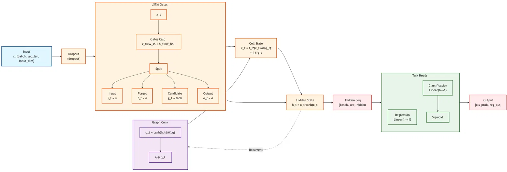

# Headwater Streamflow Forecasting

Code and model artifacts accompanying:

**Evaluating Data-Driven Models for Multimodal Prediction of Streamflow Magnitude and Presence in Headwater Streams**

Michael Murphy¹, Cristina Prieto¹, Alex Huang¹, Krish Patel¹, Allison Wang¹, Amber Yu¹, Anika Krishnan¹, Anya Danes¹, Audrey Wong¹, Akshath Kandadai¹, Sanika Iyer¹, Viksar Dubey¹, Vivian Nguyen¹, Gericke Cook², Nathan Chelgren², Konrad Hafen³, and Jacob Zwart²

¹ Student Association for Applied Statistics (SAAS), University of California, Berkeley<br>
² United States Geological Survey (USGS)<br>
³ Department of Geography and Environmental Studies, Texas State University

This project uses stream observations, meteorological drivers, and watershed characteristics from the H.J. Andrews Experimental Forest in Oregon to predict water presence and stream discharge.

## Models

| Model | Task | Notebook |
|---|---|---|
| Logistic Regression | Water presence | [LR](lr/lr.ipynb) |
| XGBoost | Water presence | [XGBoost](xgb/xgb.ipynb) |
| LSTM, HOBO sensor sites | Water presence | [HOBO LSTM](lstm/lstm_hobo_sites.ipynb) |
| LSTM, all sites | Water presence | [All-sites LSTM](lstm/lstm_all_sites.ipynb) |
| Recurrent Graph Convolutional Network | Water presence and discharge | [RGCN](rgcn/rgcn_eval.ipynb) |

Water-presence forecasts use a three-calendar-day horizon. The all-sites LSTM and RGCN include discharge-derived dry labels and an indicator identifying whether water-presence inputs are available. HOBO-only models use seed 42; the all-sites LSTM and RGCN use seeds 42, 43, and 44.

## Architecture

<a href="results/paper/rgcn_diagram.png"></a>

The RGCN combines recurrent temporal processing with upstream graph aggregation and separate water-presence and discharge heads. The diagram is a simplified schematic: graph transfer uses the previous hidden state, including a learned bias, and the node axis follows the checkpoint's graph ordering. Availability construction and forecast-tail masking occur during input preparation.

## Setup

```bash
git clone https://github.com/michaeltm365/saas-river-forecasting.git
cd saas-river-forecasting
uv sync
uv run python download_data.py --canonical-only
```

The downloader verifies file checksums and restores the paths expected by the scripts. Install a Jupyter frontend separately to run notebooks.

## Reproduction requirements

- **Environment:** use `uv sync` with the committed `uv.lock`. Tested on Linux with Python 3.13.12 and PyTorch 2.12.1+cu126. The package declares Python 3.11 or later.
- **Downloads:** the canonical artifact bundle is approximately 190 MB (181 MiB), excluding the Python environment. Retraining also needs raw observations and drivers; the meteorological CSV alone is approximately 2.29 GB (2.13 GiB).
- **CPU tasks:** saved-prediction verification, the inference example below, and HOBO model training. Allow several GB of RAM when loading the full-network RGCN arrays.
- **GPU tasks:** the all-sites LSTM training runner and RGCN training/export require a CUDA-capable NVIDIA GPU. Reference runs used an RTX 6000 Ada with 48 GB VRAM and CUDA 12.6 PyTorch wheels.
- **Approximate runtime:** saved-result checks take seconds and HOBO reproduction typically takes a few minutes. Recent RGCN runs took about 18 seconds per epoch, or 20–30 minutes per seed depending on early stopping. The all-sites LSTM takes roughly a minute per seed on the reference GPU. These are workload estimates, not hardware benchmarks; downloads are additional.

For raw training inputs:

```bash
uv run python download_data.py --include drivers
```

## Small inference example

Run a three-day-ahead forecast with the seed-42 RGCN and a prepared release input window:

```bash
uv run python examples/predict_rgcn.py \
  --site-id 55000900097170 \
  --target-date 2020-09-20
```

The command runs on CPU and prints the issue date, target date, water-presence probability, wet/dry classification at a 0.5 threshold, and discharge in m³/s. Use `--device cuda` for GPU inference, or `--seed 43` / `--seed 44` for the other checkpoints.

The example uses the released historical inputs. The target date must lie within their date range and have a complete input window. It prepares all 793 graph nodes in checkpoint order, runs the network, then selects the requested reach. Model input shape is `(793, 33, 36)`: 30 history days plus three forecast-tail days, with 36 ordered features including status availability. Prepared continuous features are already normalized; the example constructs availability and applies the canonical forecast-tail mask. Output column 0 is already P(wet); column 1 is transformed back from log(1 + discharge) using `expm1`.

## Reproduce

Verify committed results without retraining:

```bash
uv run python benchmarks/verify_paper_results.py
uv run python benchmarks/paper_canonical_report.py
uv run python -m unittest discover -s tests -q
```

Retrain the HOBO models and regenerate Figure 3:

```bash
uv run python benchmarks/hobo_report.py
uv run python benchmarks/figure3.py
```

See [RGCN training and inference](rgcn/pipeline/README.md) for graph-model reproduction and [`benchmarks/lstm_all_sites.py`](benchmarks/lstm_all_sites.py) for all-sites LSTM training. [Checkpoint verification](benchmarks/verify_checkpoints.py) evaluates the downloaded augmented-model checkpoints on CUDA.

## Repository contents

- [`src/hja/`](src/hja/): shared preprocessing, models, and evaluation
- [`examples/predict_rgcn.py`](examples/predict_rgcn.py): checkpoint inference example
- [`benchmarks/`](benchmarks/): training, verification, and figure scripts
- [`rgcn/pipeline/`](rgcn/pipeline/): graph-model training and inference
- [`results/paper/`](results/paper/README.md): paper results, predictions, and figures
- [Hugging Face](https://huggingface.co/michaeltm365/saas-river-forecasting): trained models and prepared inputs

[Figure 3 and its panels](results/paper/figure3/) are PNG only. Numerical importance values and provenance are in [`results/paper/feature_importance/`](results/paper/feature_importance/).

## Data

Zwart, J.A., K.C. Hafen, N. Chelgren, and J. Dunham, 2026. Integrated Streamflow, Water Presence, and Meteorological Drivers for Stream Network Modeling in the HJ Andrews Experimental Forest. doi:[10.5066/P19R5TXW](https://doi.org/10.5066/P19R5TXW).
